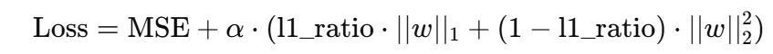

### MLFLOW Project ON AWS

ワインのデータ：https://raw.githubusercontent.com/mlflow/mlflow/master/tests/datasets/winequality-red.csv

##

ElasticNet モデル説明：
ElasticNet（エラスティックネット） は、線形回帰の一種で、以下の 2 つの手法を組み合わせたものです：

🔷 1. 概要：
Lasso 回帰（L1 正則化）：
→ 不要な特徴量（カラム）の係数を 0 にして、特徴選択を行う

Ridge 回帰（L2 正則化）：
→ 係数の大きさを小さく保つことで、モデルの複雑さを抑える

🔷 2. ElasticNet の特徴：
ElasticNet は、L1 と L2 のバランスを調整できるハイブリッドモデルです。

α（alpha）：正則化の強さ

l1_ratio：L1 と L2 の比率（0 なら Ridge、1 なら Lasso）

📊 ワインデータの特徴：
| 特徴量（列） | 説明（簡単に） |
| -------------------- | ----------- |
| fixed acidity | 固定酸 |
| volatile acidity | 揮発酸 |
| citric acid | クエン酸 |
| residual sugar | 残糖 |
| chlorides | 塩化物 |
| free sulfur dioxide | 遊離亜硫酸 |
| total sulfur dioxide | 総亜硫酸 |
| density | 密度 |
| pH | 酸性度 |
| sulphates | 硫酸塩 |
| alcohol | アルコール含有量 |
| quality（予測対象） | ワインの品質（スコア） |

| 理由                            | 説明                                                                                         |
| ------------------------------- | -------------------------------------------------------------------------------------------- |
| ✅ **複数の特徴量がある**       | → 11 個の連続値特徴量があり、どれが重要かは事前にわからない                                  |
| ✅ **特徴間に相関がある可能性** | → たとえば「density」と「residual sugar」は関係しているかもしれない。L2 正則化で安定性アップ |
| ✅ **特徴選択もしたい**         | → L1 正則化で不要な特徴量をゼロにできる                                                      |
| ✅ **過学習を防ぎたい**         | → 正則化（L1+L2）により過学習リスクを軽減                                                    |
| ✅ **線形モデルで解釈しやすい** | → 重みがそのまま「どの特徴が重要か」のヒントになる                                           |

##

このプロジェクトでは、ワインの品質データセットを用いて ElasticNet モデルを訓練し、MLflow を活用してモデルの学習過程や評価指標を追跡・管理します。
最終的には、訓練したモデルを AWS EC2 上の仮想サーバーにデプロイします。

## MLflow on AWS Setup:

1. Login to AWS console.
2. Create IAM user with AdministratorAccess
3. Export the credentials in your AWS CLI by running "aws configure"
4. Create a s3 bucket
5. Create EC2 machine (Ubuntu) & add Security groups 5000 port

Run the following command on EC2 machine

```bash
sudo apt update

sudo apt install python3-pip

sudo apt install pipenv

sudo apt install virtualenv

mkdir mlflow

cd mlflow

pipenv install mlflow

pipenv install awscli

pipenv install boto3

pipenv shell


## Then set aws credentials
aws configure


#Finally
mlflow server -h 0.0.0.0 --default-artifact-root s3://mlflowtracking1008

#open Public IPv4 DNS to the port 5000


#set uri in your local terminal and in your code
export MLFLOW_TRACKING_URI=http://ec2-3-115-116-130.ap-northeast-1.compute.amazonaws.com:5000/
```
